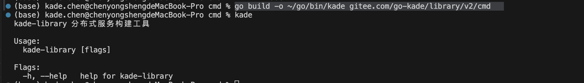
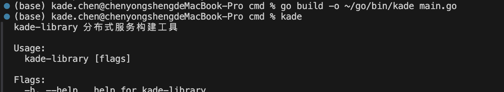

# 1.install binary package in this way

```go

go build -o ~/go/bin/kade gitee.com/go-kade/library/v2/cmd 

```




# 2. install binary package using main.go
```go

go build -o ~/go/bin/kade main.go

```
